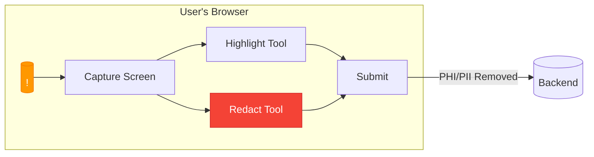
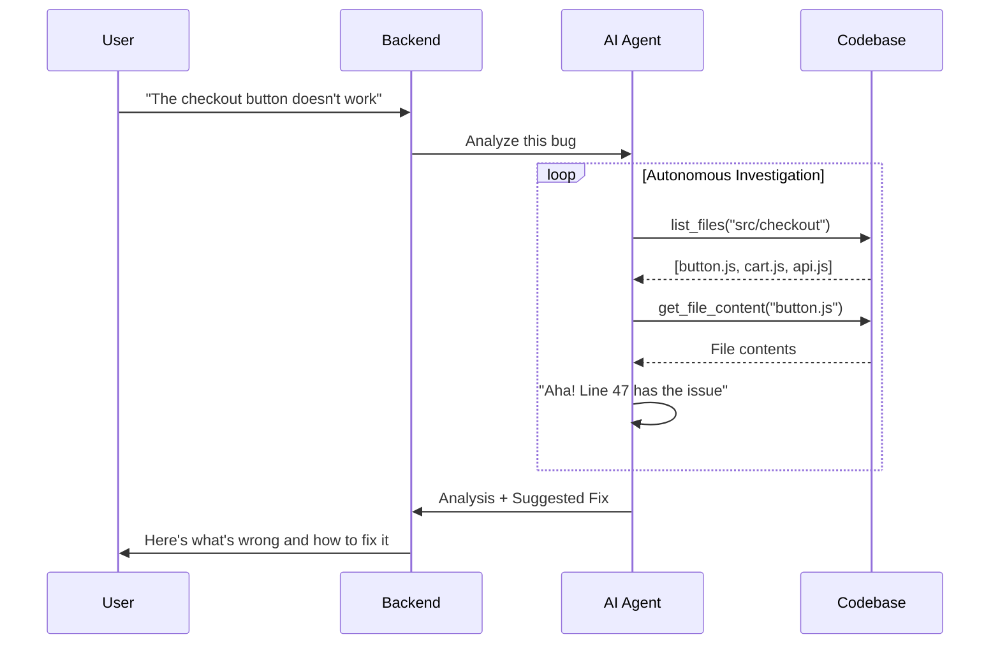
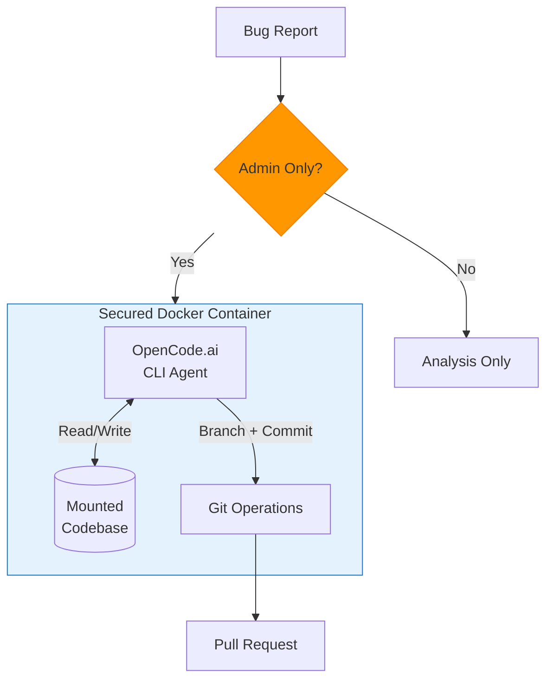
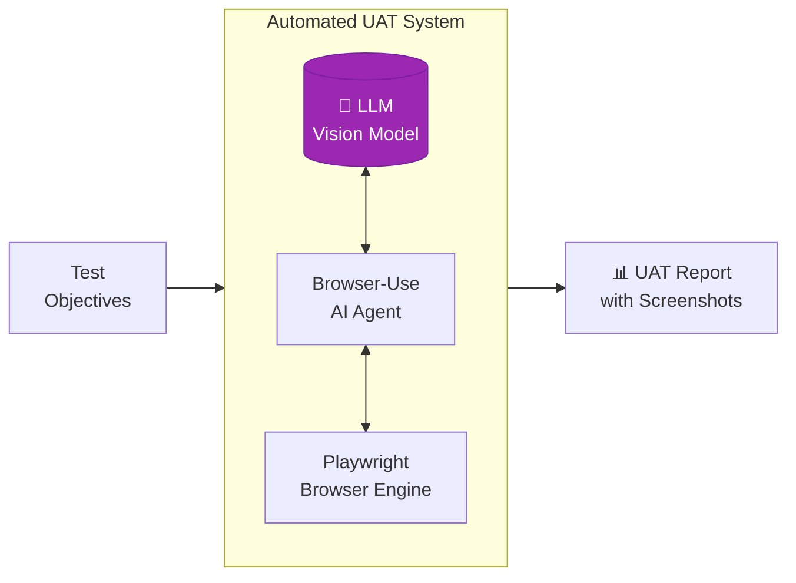
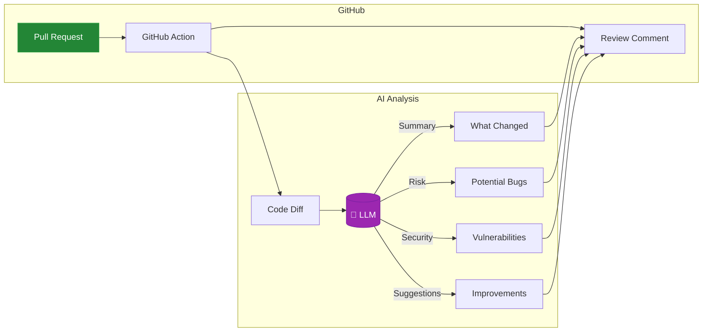
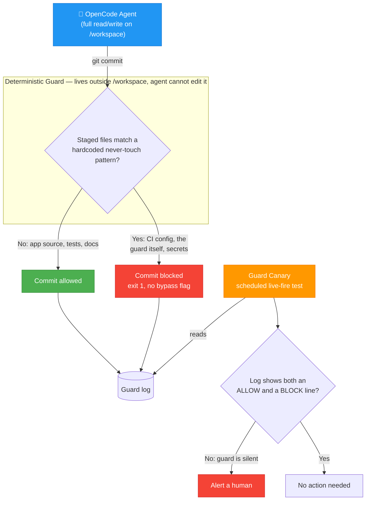
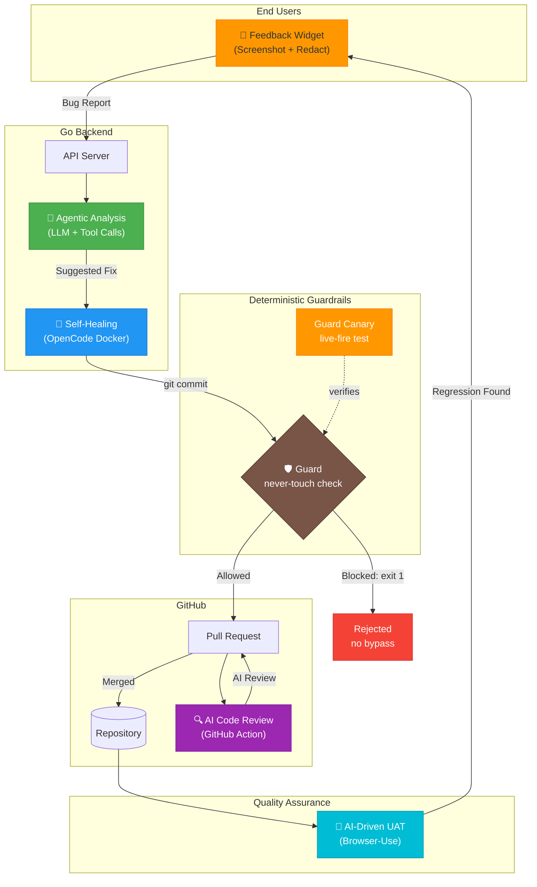

# Feedback Service

**A Living Laboratory for AI-Powered Development Practices**

> *"What if your users' bug reports could fix themselves?"*

Built by [Blue Fermion Labs](https://bluefermionlabs.com)

---

## What Is This?

This isn't a product. It's a **technology showcase** — a fully functional demonstration of how modern engineering teams can leverage AI across the entire software development lifecycle.

Think of it as a concept car for software engineering. Every feature you see here represents a capability your team could adopt today.

```
┌─────────────────────────────────────────────────────────────────────────┐
│                    THE AI-AUGMENTED DEVELOPMENT LOOP                    │
│                                                                         │
│    User Reports Bug → AI Analyzes → AI Suggests Fix → AI Reviews PR     │
│         ↑                                                      ↓        │
│         └──────────── AI Tests the Fix Automatically ←─────────┘        │
└─────────────────────────────────────────────────────────────────────────┘
```

---

## The Six Innovations

### 1. 📸 Privacy-First Screenshot Capture

**The Problem:** Users say "it's broken" but can't explain what they saw.

**The Solution:** A floating button that captures annotated screenshots—with built-in tools to **highlight problems** and **redact sensitive information** before submission.


```mermaid
flowchart LR
    subgraph Browser["User's Browser"]
        A[("!")] --> B[Capture Screen]
        B --> C[Highlight Tool]
        B --> D[Redact Tool]
        C --> E[Submit]
        D --> E
    end
    E -->|"PHI/PII Removed"| F[(Backend)]

    style A fill:#FF9800,stroke:#F57C00,color:#fff
    style D fill:#f44336,stroke:#d32f2f,color:#fff
```

**Why it matters:** Your users can show you exactly what went wrong without accidentally sharing their medical records, financial data, or embarrassing browser tabs.

**Technologies:** Vanilla JavaScript, Canvas API, html2canvas pattern

---

### 2. 🤖 Agentic Bug Analysis

**The Problem:** Engineers spend hours reproducing bugs before they even start fixing them.

**The Solution:** When a bug report arrives, an AI agent automatically investigates your codebase using tool calls—just like a junior developer would.


```mermaid
sequenceDiagram
    participant User
    participant Backend
    participant LLM as AI Agent
    participant Codebase

    User->>Backend: "The checkout button doesn't work"
    Backend->>LLM: Analyze this bug

    loop Autonomous Investigation
        LLM->>Codebase: list_files("src/checkout")
        Codebase-->>LLM: [button.js, cart.js, api.js]
        LLM->>Codebase: get_file_content("button.js")
        Codebase-->>LLM: File contents
        LLM->>LLM: "Aha! Line 47 has the issue"
    end

    LLM->>Backend: Analysis + Suggested Fix
    Backend->>User: Here's what's wrong and how to fix it
```

**Why it matters:** The AI does the detective work. Your engineers start with context, not confusion.

**Technologies:** Go backend, LLM tool calling, Path-restricted file access

---

### 3. 🐳 Self-Healing Code (The Bold Experiment)

**The Problem:** Even with analysis, someone still has to write the fix.

**The Solution:** For approved administrators, the system can spin up a secure Docker container running [OpenCode.ai](https://opencode.ai) (the open-source cousin of Claude Code and GitHub Copilot CLI) to actually **implement the fix** and create a pull request.


```mermaid
flowchart TB
    subgraph SafeZone["Secured Docker Container"]
        OC[OpenCode.ai<br/>CLI Agent]
        FS[(Mounted<br/>Codebase)]
        Git[Git Operations]

        OC <-->|"Read/Write"| FS
        OC -->|"Branch + Commit"| Git
    end

    Bug[Bug Report] --> Guard{Admin Only?}
    Guard -->|"Yes"| SafeZone
    Guard -->|"No"| Analysis[Analysis Only]
    Git --> PR[Pull Request]

    style SafeZone fill:#e3f2fd,stroke:#1976d2
    style Guard fill:#ff9800,stroke:#f57c00
```

**Why it matters:** This is the future—AI that doesn't just advise, but acts. The Docker isolation ensures it can only modify what you allow.

**Technologies:** Docker, OpenCode.ai, Git automation, Role-based access control

---

### 4. 🧪 AI-Driven User Acceptance Testing

**The Problem:** Manual UAT is slow, expensive, and humans get tired.

**The Solution:** An LLM that can **see** your UI (via screenshots) and **use** your UI (via browser automation) to verify features work correctly.


```mermaid
flowchart LR
    subgraph UAT["Automated UAT System"]
        direction TB
        LLM[("🧠 LLM<br/>Vision Model")]
        PW[Playwright<br/>Browser Engine]
        BU[Browser-Use<br/>AI Agent]

        LLM <--> BU
        BU <--> PW
    end

    Config[Test<br/>Objectives] --> UAT
    UAT --> Report[📊 UAT Report<br/>with Screenshots]

    style LLM fill:#9c27b0,stroke:#7b1fa2,color:#fff
```

**The workflow:**
1. You describe objectives in plain English: *"User should be able to submit a bug report"*
2. The AI agent navigates your app like a real user
3. It takes screenshots and evaluates against your criteria
4. You get a detailed report with pass/fail status and recommendations

**Why it matters:** Your QA capacity just became infinite. Run comprehensive UI tests on every commit without hiring an army of testers.

**Technologies:** [Playwright](https://playwright.dev), [Browser-Use](https://github.com/browser-use/browser-use), Groq/Llama vision models

---

### 5. 🔍 AI-Powered Code Review (GitHub Action)

**The Problem:** Pull requests pile up. Reviewers are overwhelmed. Obvious issues slip through.

**The Solution:** A GitHub Action that automatically reviews every PR with an LLM, checking for bugs, security issues, and best practices—then posts its findings as a comment.


```mermaid
flowchart LR
    subgraph GitHub["GitHub"]
        PR[Pull Request] --> Action[GitHub Action]
        Action --> Comment[Review Comment]
    end

    subgraph Analysis["AI Analysis"]
        Diff[Code Diff] --> LLM[("🧠 LLM")]
        LLM --> |Summary| Out1[What Changed]
        LLM --> |Risk| Out2[Potential Bugs]
        LLM --> |Security| Out3[Vulnerabilities]
        LLM --> |Suggestions| Out4[Improvements]
    end

    Action --> Diff
    Out1 & Out2 & Out3 & Out4 --> Comment

    style PR fill:#238636,stroke:#2ea043,color:#fff
    style LLM fill:#9c27b0,stroke:#7b1fa2,color:#fff
```

**Why it matters:** Every PR gets a first-pass review instantly. Human reviewers can focus on architecture and business logic instead of catching typos and obvious bugs.

**Technologies:** GitHub Actions, LLM API (GPT/Llama/Claude), Bash scripting

---

### 6. 🛡️ Guardrails You Can't Talk Your Way Past (Deterministic AI Governance)

**The Problem:** Innovation #3 hands an AI agent a Docker container and admin approval, then trusts the agent — and every prompt that reaches it — to behave. The only gate is `ADMIN_EMAILS`, checked in application code: the same class of code the agent can read and, given write access to the repo, edit. The LLM-based checks in `internal/selfhealing/guards.go` are a different tool for a different job — they classify *text* for injection or toxicity, and, like most content classifiers, this repo's own implementation deliberately **fails open** when the classifier is unavailable. That's a defensible default for "is this message toxic?" It is the wrong default for "can this agent write to disk?"

We found the gap while building this: `config/opencode.toml.template` has declared `[safety] enabled = true` since this project's first commit. Nothing has ever read that file. It's dead config pretending to be a safety net — the exact failure mode a sibling internal project, **watch.ai** (an agent-supervision layer, not open source), was built to catch, after a real deny-hook there sat silently broken for a month because a missing settings file made it fail with no error at all.

**The Solution:** A second boundary that isn't part of the conversation with the LLM at all. `scripts/guard/pre-commit` is a plain `git` hook — no model, no prompt, no judgment call, just pattern matching — installed as `core.hooksPath` at `/etc/opencode-guard/hooks`, a path baked into the Docker image **outside** the read-write `/workspace` mount the agent operates in (see `Dockerfile.selfhealing`, `scripts/analyze.sh`). The agent has full read/write access to the rest of the repo, including its own `.git/hooks/` — but it cannot reach this file to edit or disable it, because it isn't inside the mount it can write to. The hook hard-rejects any commit that touches the guard itself, `.github/workflows/**`, or anything secret-shaped, before it ever reaches disk history.

A rule nobody checks eventually stops being true. `scripts/guard/guard-canary.sh` (`make guard-canary`) live-fire-tests the boundary on a disposable scratch repo: it *tries* to commit a forbidden change and asserts it's rejected, tries a legitimate change and asserts it's allowed, and checks the guard's own log to prove the hook actually ran rather than silently no-op'ing. It exits non-zero the moment any of that stops being true — the same "does the log show it's still alive?" signature watch.ai's canary checks.


```mermaid
flowchart TB
    Agent["🤖 OpenCode Agent<br/>(full read/write on /workspace)"]

    subgraph Boundary["Deterministic Guard — lives outside /workspace, agent cannot edit it"]
        direction TB
        Check{"Staged files match a<br/>hardcoded never-touch pattern?"}
    end

    Agent -->|"git commit"| Check
    Check -->|"No: app source, tests, docs"| Allow["Commit allowed"]
    Check -->|"Yes: CI config, the<br/>guard itself, secrets"| Block["Commit blocked<br/>exit 1, no bypass flag"]

    Allow --> Log[("Guard log")]
    Block --> Log

    Canary["Guard Canary<br/>scheduled live-fire test"] -->|"reads"| Log
    Canary --> Alert{"Log shows both an<br/>ALLOW and a BLOCK line?"}
    Alert -->|"No: guard is silent"| PageHuman["Alert a human"]
    Alert -->|"Yes"| Quiet["No action needed"]

    style Agent fill:#2196F3,stroke:#1976D2,color:#fff
    style Block fill:#f44336,stroke:#d32f2f,color:#fff
    style Allow fill:#4CAF50,stroke:#388E3C,color:#fff
    style Canary fill:#FF9800,stroke:#F57C00,color:#fff
    style PageHuman fill:#f44336,stroke:#d32f2f,color:#fff
```

**Why it matters:** This is where "self-healing" stops being a story about clever automation and starts being a story about **governance** — the deliberate, human decision about what an autonomous system is and isn't allowed to do, enforced independently of whatever the system itself decides in the moment. Three properties make the difference:

- **It can't be argued with.** A `case` statement has no theory of mind to social-engineer. Prompt injection, jailbreaks, and "ignore previous instructions" attacks all work by changing what a *reasoning* system concludes — they have no purchase on code that isn't reasoning at all.
- **It can't modify its own oversight.** The moment an autonomous system can edit the mechanism constraining it, that mechanism is a suggestion, not a rule. Keeping the guard outside the agent's writable filesystem — a small, mechanical instance of the same "capability absence" principle behind another internal project, **pool.ai**, never holding the credentials to dose chemicals itself — is what turns this from a policy into an actual boundary.
- **It's verified, not assumed.** A guard nobody checks is a liability wearing a safety label. The canary is what makes the difference between "we believe this is safe" and "we can currently prove it."

None of this is specific to bug-fixing agents. As AI systems get real-world capability — writing code, opening PRs, eventually touching production — *someone* has to decide, in advance and in the open, what they may never do regardless of how convincing the reasoning for doing it looks in the moment. That decision is what governance means here: not a values statement, a hardcoded boundary a human wrote, that fails closed, that the system under it cannot reach, and that gets tested rather than trusted.

**Technologies:** `git` hooks (`core.hooksPath`), Docker image-layer isolation, Bash — deliberately zero LLM calls in the enforcement path

---

## The Big Picture

Here's how all six innovations work together:


```mermaid
flowchart TB
    subgraph Users["End Users"]
        Widget["📱 Feedback Widget<br/>(Screenshot + Redact)"]
    end

    subgraph Backend["Go Backend"]
        API["API Server"]
        Analyze["🤖 Agentic Analysis<br/>(LLM + Tool Calls)"]
        Heal["🐳 Self-Healing<br/>(OpenCode Docker)"]
    end

    subgraph Governance["Deterministic Guardrails"]
        Guard{"🛡️ Guard<br/>never-touch check"}
        Canary["Guard Canary<br/>live-fire test"]
    end

    subgraph GitHub["GitHub"]
        Repo[(Repository)]
        Action["🔍 AI Code Review<br/>(GitHub Action)"]
        PR[Pull Request]
    end

    subgraph QA["Quality Assurance"]
        UAT["🧪 AI-Driven UAT<br/>(Browser-Use)"]
    end

    Widget -->|"Bug Report"| API
    API --> Analyze
    Analyze -->|"Suggested Fix"| Heal
    Heal -->|"git commit"| Guard
    Guard -->|"Allowed"| PR
    Guard -->|"Blocked: exit 1"| Rejected["Rejected<br/>no bypass"]
    Canary -.->|"verifies"| Guard
    PR --> Action
    Action -->|"AI Review"| PR
    PR -->|"Merged"| Repo
    Repo --> UAT
    UAT -->|"Regression Found"| Widget

    style Widget fill:#FF9800,stroke:#F57C00
    style Analyze fill:#4CAF50,stroke:#388E3C,color:#fff
    style Heal fill:#2196F3,stroke:#1976D2,color:#fff
    style Action fill:#9C27B0,stroke:#7B1FA2,color:#fff
    style UAT fill:#00BCD4,stroke:#0097A7,color:#fff
    style Guard fill:#795548,stroke:#4E342E,color:#fff
    style Canary fill:#FF9800,stroke:#F57C00,color:#fff
    style Rejected fill:#f44336,stroke:#d32f2f,color:#fff
```

---

## Quick Start

### Option 1: Just the Widget (5 minutes)

```bash
git clone https://github.com/bluefermion/feedback.git
cd feedback
make run
```

Open http://localhost:8080/demo and click the orange button.

### Option 2: Full AI Experience (15 minutes)

```bash
# Clone and configure
git clone https://github.com/bluefermion/feedback.git
cd feedback
make setup   # Creates .env from template

# Edit .env with your API key
# LLM_API_KEY=your-groq-or-openai-key
# OPENCODE_ENABLED=true
# SELFHEALING_MODE=analyze

make run
```

Submit feedback and watch the AI analyze it in real-time.

---

## Technology Stack

| Layer | Technology | Why We Chose It |
|-------|------------|-----------------|
| **Backend** | Go 1.24+ | Fast, simple, single binary deployment |
| **Database** | SQLite (WAL mode) | Zero-ops, embedded, surprisingly capable |
| **Frontend Widget** | Vanilla JS | No build step, works everywhere |
| **LLM Integration** | Groq/OpenAI-compatible | Tool calling, streaming, vision |
| **Browser Automation** | Playwright + Browser-Use | Reliable, AI-native |
| **CI/CD** | GitHub Actions | Where your code already lives |
| **Containerization** | Docker | Secure isolation for self-healing |
| **Guardrails** | `git` hooks (`core.hooksPath`) + Bash | Deterministic — a boundary the agent can't argue past, and can't reach to disable |

---

## For the Technically Curious

<details>
<summary><strong>📁 Project Structure</strong></summary>

```
feedback/
├── cmd/server/          # Entry point
├── internal/
│   ├── handler/         # HTTP handlers (API + HTML)
│   ├── model/           # Data structures
│   ├── repository/      # SQLite CRUD
│   └── selfhealing/     # LLM analysis + tool calling + probabilistic guards
├── widget/
│   └── js/              # Frontend widget (auto-initializes)
├── uat/
│   ├── run_uat.py       # Browser-Use test runner
│   └── llm_vision.py    # Screenshot analysis
├── .github/workflows/
│   └── commit-analysis.yml  # AI code review
├── scripts/guard/
│   ├── pre-commit       # Deterministic guard (git hook, no LLM)
│   └── guard-canary.sh  # Live-fire test that the guard still fires
└── Dockerfile.selfhealing  # Self-healing container (guard baked in outside /workspace)
```

</details>

<details>
<summary><strong>🔌 API Endpoints</strong></summary>

| Endpoint | Method | Purpose |
|----------|--------|---------|
| `/api/feedback` | POST | Submit feedback |
| `/api/feedback` | GET | List feedback (paginated) |
| `/api/feedback/{id}` | GET | Get specific entry |
| `/api/selfhealing/status` | GET | Check AI system status |
| `/feedback` | GET | Admin dashboard (HTML) |
| `/demo` | GET | Widget demo page |

</details>

<details>
<summary><strong>⚙️ Configuration</strong></summary>

| Variable | Purpose | Default |
|----------|---------|---------|
| `PORT` | Server port | 8080 |
| `LLM_API_KEY` | Groq/OpenAI API key | — |
| `SELFHEALING_MODE` | `analyze` or `opencode` | analyze |
| `ADMIN_EMAILS` | Who can trigger self-healing | — |
| `SOURCE_DIR` | Path restriction for file access | . |

See `.env.example` for the complete list.

</details>

---

## Why This Matters for Your Team

This repository demonstrates a mindset shift: **AI as a collaborator, not just a tool.**

| Traditional Approach | AI-Augmented Approach |
|---------------------|----------------------|
| User reports bug via email | User captures annotated screenshot |
| Engineer spends 2 hours reproducing | AI investigates in 30 seconds |
| Engineer writes fix | AI drafts fix, engineer reviews |
| Manual code review (days) | AI first-pass review (minutes) |
| Manual UAT (expensive) | AI-driven UAT (scalable) |
| "Please don't touch prod" as a policy | A boundary the agent structurally cannot reach, verified by a canary |

The technologies here aren't science fiction—they're production-ready today. This repository shows how to wire them together.

---

## What's Next?

This is an evolving showcase. Upcoming experiments:

- [ ] **Voice-to-feedback** — Describe bugs by talking
- [ ] **Multi-repo analysis** — AI that understands your monorepo
- [ ] **Predictive testing** — AI identifies risky code paths before bugs happen
- [ ] **Sentiment-aware triage** — Prioritize based on user frustration level
- [ ] **Capability-absence for merge/deploy** — extend Innovation #6: strip merge and production credentials from the OpenCode container entirely, so the agent that proposes a fix is structurally unable to ship it unsupervised, the way pool.ai (another internal project) never holds the credentials to dose pool chemicals itself

---

## License

MIT License — Use this however you want. Attribution appreciated.

See [LICENSE](LICENSE) for details.

---

## About Blue Fermion Labs

We build tools that make engineering teams more effective. This feedback service powers real applications at [demeterics.ai](https://demeterics.ai).

Questions? Ideas? [Open an issue](https://github.com/bluefermion/feedback/issues) or reach out at [bluefermionlabs.com](https://bluefermionlabs.com).

---

<p align="center">
  <em>"The best bug is the one that fixes itself."</em>
</p>
