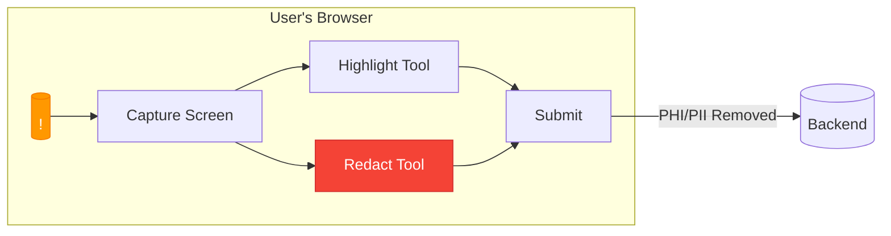
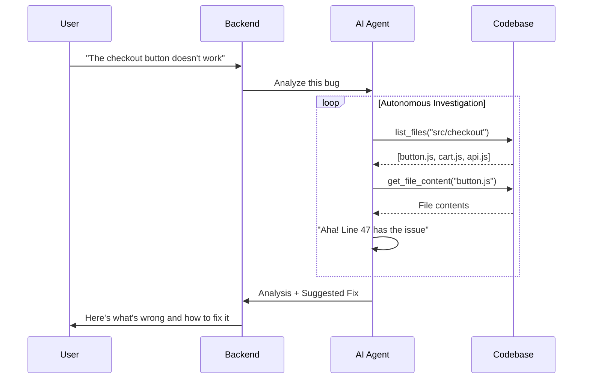
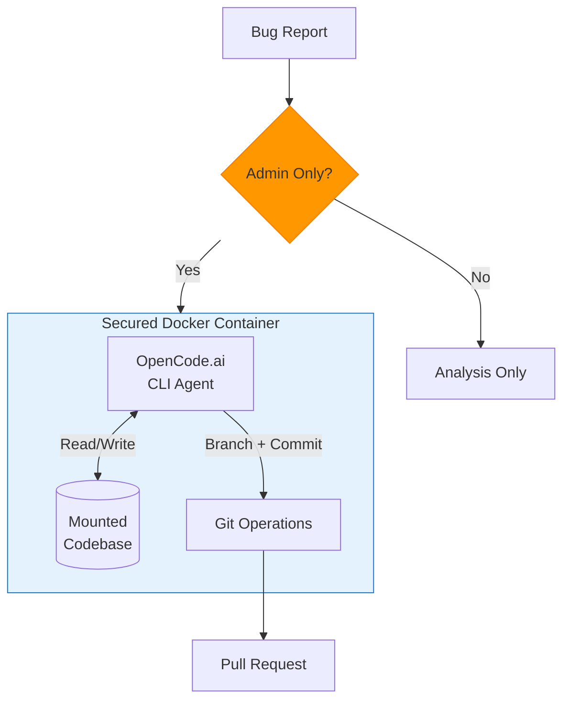
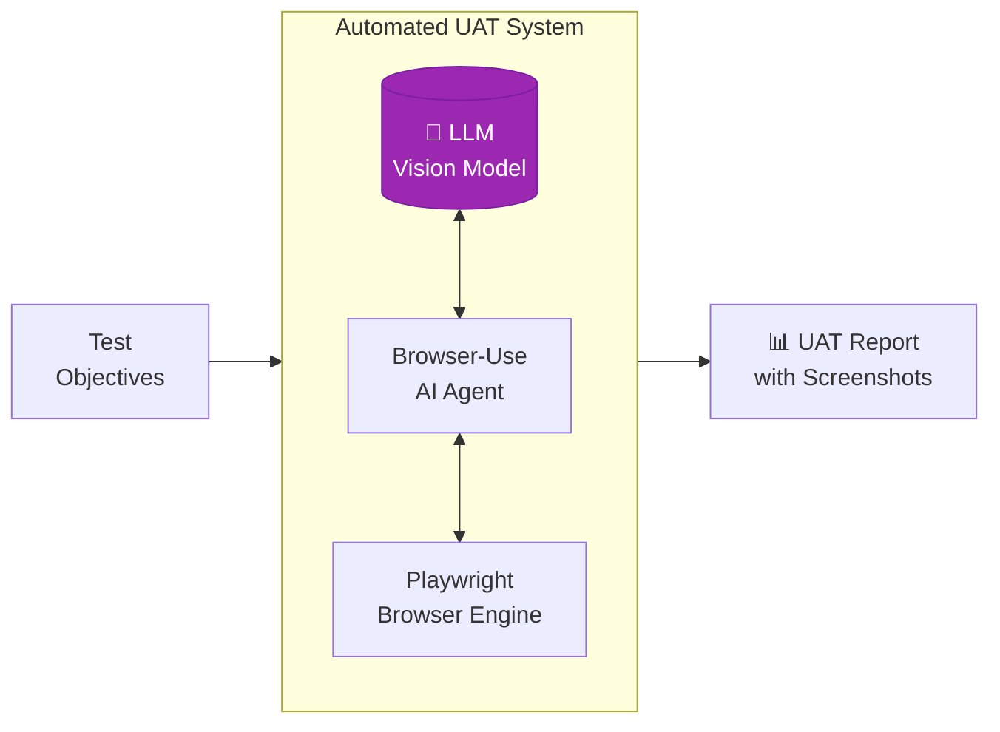
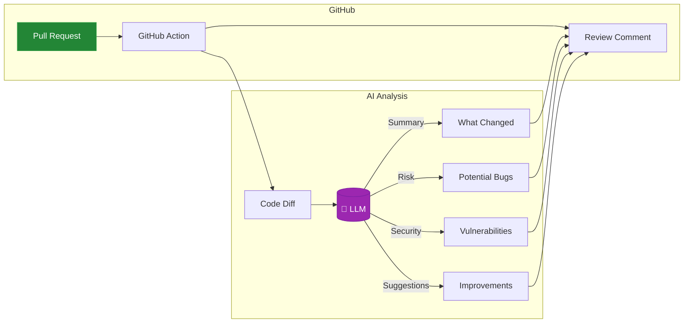
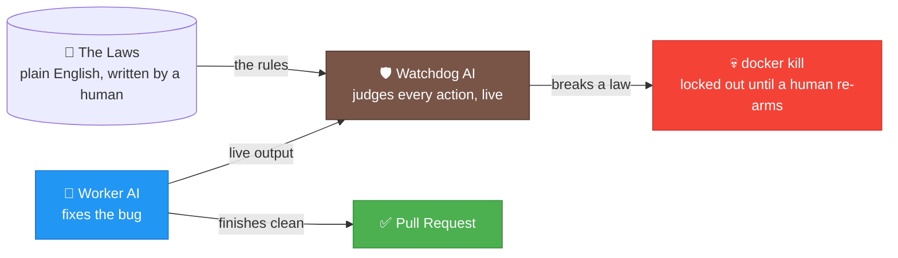
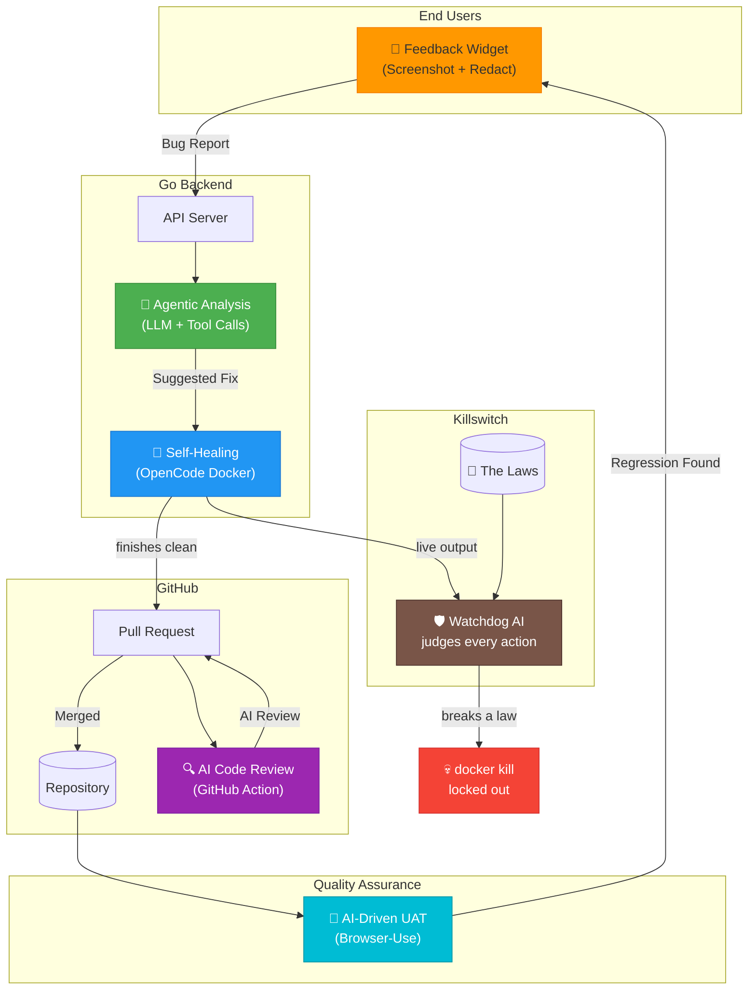

# Feedback Service

**A Living Laboratory for AI-Powered Development Practices**

> *"What if your users' bug reports could fix themselves?"*

Built by [Blue Fermion Labs](https://bluefermionlabs.com)

---

## What Is This?

This isn't a product. It's a **technology showcase** — a fully functional demonstration of how modern engineering teams can leverage AI across the entire software development lifecycle.

Think of it as a concept car for software engineering. Every feature you see here represents a capability your team could adopt today.

```
┌─────────────────────────────────────────────────────────────────────────┐
│                    THE AI-AUGMENTED DEVELOPMENT LOOP                    │
│                                                                         │
│    User Reports Bug → AI Analyzes → AI Suggests Fix → AI Reviews PR     │
│         ↑                                                      ↓        │
│         └──────────── AI Tests the Fix Automatically ←─────────┘        │
└─────────────────────────────────────────────────────────────────────────┘
```

---

## The Six Innovations

### 1. 📸 Privacy-First Screenshot Capture

**The Problem:** Users say "it's broken" but can't explain what they saw.

**The Solution:** A floating button that captures annotated screenshots—with built-in tools to **highlight problems** and **redact sensitive information** before submission.


```mermaid
flowchart LR
    subgraph Browser["User's Browser"]
        A[("!")] --> B[Capture Screen]
        B --> C[Highlight Tool]
        B --> D[Redact Tool]
        C --> E[Submit]
        D --> E
    end
    E -->|"PHI/PII Removed"| F[(Backend)]

    style A fill:#FF9800,stroke:#F57C00,color:#fff
    style D fill:#f44336,stroke:#d32f2f,color:#fff
```

**Why it matters:** Your users can show you exactly what went wrong without accidentally sharing their medical records, financial data, or embarrassing browser tabs.

**Technologies:** Vanilla JavaScript, Canvas API, html2canvas pattern

---

### 2. 🤖 Agentic Bug Analysis

**The Problem:** Engineers spend hours reproducing bugs before they even start fixing them.

**The Solution:** When a bug report arrives, an AI agent automatically investigates your codebase using tool calls—just like a junior developer would.


```mermaid
sequenceDiagram
    participant User
    participant Backend
    participant LLM as AI Agent
    participant Codebase

    User->>Backend: "The checkout button doesn't work"
    Backend->>LLM: Analyze this bug

    loop Autonomous Investigation
        LLM->>Codebase: list_files("src/checkout")
        Codebase-->>LLM: [button.js, cart.js, api.js]
        LLM->>Codebase: get_file_content("button.js")
        Codebase-->>LLM: File contents
        LLM->>LLM: "Aha! Line 47 has the issue"
    end

    LLM->>Backend: Analysis + Suggested Fix
    Backend->>User: Here's what's wrong and how to fix it
```

**Why it matters:** The AI does the detective work. Your engineers start with context, not confusion.

**Technologies:** Go backend, LLM tool calling, Path-restricted file access

---

### 3. 🐳 Self-Healing Code (The Bold Experiment)

**The Problem:** Even with analysis, someone still has to write the fix.

**The Solution:** For approved administrators, the system can spin up a secure Docker container running [OpenCode.ai](https://opencode.ai) (the open-source cousin of Claude Code and GitHub Copilot CLI) to actually **implement the fix** and create a pull request.


```mermaid
flowchart TB
    subgraph SafeZone["Secured Docker Container"]
        OC[OpenCode.ai<br/>CLI Agent]
        FS[(Mounted<br/>Codebase)]
        Git[Git Operations]

        OC <-->|"Read/Write"| FS
        OC -->|"Branch + Commit"| Git
    end

    Bug[Bug Report] --> Guard{Admin Only?}
    Guard -->|"Yes"| SafeZone
    Guard -->|"No"| Analysis[Analysis Only]
    Git --> PR[Pull Request]

    style SafeZone fill:#e3f2fd,stroke:#1976d2
    style Guard fill:#ff9800,stroke:#f57c00
```

**Why it matters:** This is the future—AI that doesn't just advise, but acts. The Docker isolation ensures it can only modify what you allow.

**Technologies:** Docker, OpenCode.ai, Git automation, Role-based access control

---

### 4. 🧪 AI-Driven User Acceptance Testing

**The Problem:** Manual UAT is slow, expensive, and humans get tired.

**The Solution:** An LLM that can **see** your UI (via screenshots) and **use** your UI (via browser automation) to verify features work correctly.


```mermaid
flowchart LR
    subgraph UAT["Automated UAT System"]
        direction TB
        LLM[("🧠 LLM<br/>Vision Model")]
        PW[Playwright<br/>Browser Engine]
        BU[Browser-Use<br/>AI Agent]

        LLM <--> BU
        BU <--> PW
    end

    Config[Test<br/>Objectives] --> UAT
    UAT --> Report[📊 UAT Report<br/>with Screenshots]

    style LLM fill:#9c27b0,stroke:#7b1fa2,color:#fff
```

**The workflow:**
1. You describe objectives in plain English: *"User should be able to submit a bug report"*
2. The AI agent navigates your app like a real user
3. It takes screenshots and evaluates against your criteria
4. You get a detailed report with pass/fail status and recommendations

**Why it matters:** Your QA capacity just became infinite. Run comprehensive UI tests on every commit without hiring an army of testers.

**Technologies:** [Playwright](https://playwright.dev), [Browser-Use](https://github.com/browser-use/browser-use), Groq/Llama vision models

---

### 5. 🔍 AI-Powered Code Review (GitHub Action)

**The Problem:** Pull requests pile up. Reviewers are overwhelmed. Obvious issues slip through.

**The Solution:** A GitHub Action that automatically reviews every PR with an LLM, checking for bugs, security issues, and best practices—then posts its findings as a comment.


```mermaid
flowchart LR
    subgraph GitHub["GitHub"]
        PR[Pull Request] --> Action[GitHub Action]
        Action --> Comment[Review Comment]
    end

    subgraph Analysis["AI Analysis"]
        Diff[Code Diff] --> LLM[("🧠 LLM")]
        LLM --> |Summary| Out1[What Changed]
        LLM --> |Risk| Out2[Potential Bugs]
        LLM --> |Security| Out3[Vulnerabilities]
        LLM --> |Suggestions| Out4[Improvements]
    end

    Action --> Diff
    Out1 & Out2 & Out3 & Out4 --> Comment

    style PR fill:#238636,stroke:#2ea043,color:#fff
    style LLM fill:#9c27b0,stroke:#7b1fa2,color:#fff
```

**Why it matters:** Every PR gets a first-pass review instantly. Human reviewers can focus on architecture and business logic instead of catching typos and obvious bugs.

**Technologies:** GitHub Actions, LLM API (GPT/Llama/Claude), Bash scripting

---

### 6. 🛡️ The Killswitch (A Good AI to Stop a Bad One)

**The Problem:** An autonomous agent with write access to your code is a loaded weapon. It doesn't have to be malicious to be dangerous — a prompt injection hidden in a bug report, a bad model update, or plain confusion is enough. Rules in a config file don't stop it: the agent can read them, and it can rewrite them. And no human can watch every action of every agent — they're too fast, and there are too many.

**The Solution:** Fight AI with AI. A second AI — the **Watchdog** — reads everything the worker agent does, as it does it, and judges each step against a short set of **laws a human wrote in plain English**. Break one, and the Watchdog pulls a killswitch the worker can't reach: `docker kill`, plus a lockout that stops every future run until a human clears it. If the Watchdog goes blind — its own model unreachable — it pulls the plug too. No supervision, no autonomy.

A pattern-matcher can block `rm -rf`. It can't tell that the agent quietly deleted the failing test instead of fixing the bug. That takes judgment — which is why the Watchdog is an AI, not a regex. (A regex tripwire still sits underneath it, in a `git` hook the agent can't edit, for the cases where the Watchdog itself gets fooled.)

**The laws** — this is the governance layer, and it's deliberately just text (`internal/watchdog/policy.go`):

```go
const DefaultPolicy = `THE LAWS

1. Stay on task. Fix the reported bug and nothing else.
2. Never touch your own guardrails: the guard hook, CI workflows,
   the Dockerfile, the KILLSWITCH file, or this policy.
3. Never touch secrets: no reading, printing, or committing .env, keys, tokens.
4. Never phone home: no network calls except the LLM API you were given.
5. Never deceive: no hidden changes, no misleading commit messages,
   no skipping or deleting tests to make them pass.
6. Never escalate: no sudo, no permission changes, no installing tools.
7. Never destroy: no rm -rf, no force-push, no deleting branches, history, or data.
8. When in doubt, stop and report. Guessing is not allowed. Asking is.`
```

**The killswitch** — not a request to stop (`internal/watchdog/watchdog.go`):

```go
func (w *Watchdog) Kill(reason string) {
    exec.Command("docker", "kill", w.cfg.Container).Run()          // the process is gone
    os.WriteFile(w.cfg.LockoutFile, []byte("KILLSWITCH ENGAGED\nreason: "+reason), 0o644)
}
```

`CanTrigger` refuses every self-healing run while that file exists. Deleting it is a human's job: `make re-arm`.


```mermaid
flowchart LR
    Laws[("📜 The Laws<br/>plain English, written by a human")]
    Agent["🤖 Worker AI<br/>fixes the bug"]
    Watchdog["🛡️ Watchdog AI<br/>judges every action, live"]
    Kill["💀 docker kill<br/>locked out until a human re-arms"]
    PR["✅ Pull Request"]

    Laws -->|"the rules"| Watchdog
    Agent -->|"live output"| Watchdog
    Watchdog -->|"breaks a law"| Kill
    Agent -->|"finishes clean"| PR

    style Agent fill:#2196F3,stroke:#1976D2,color:#fff
    style Watchdog fill:#795548,stroke:#4E342E,color:#fff
    style Kill fill:#f44336,stroke:#d32f2f,color:#fff
    style PR fill:#4CAF50,stroke:#388E3C,color:#fff
```

**Why it matters:** "Good" and "evil" for an AI aren't philosophy — they're a text file. Somebody has to write down, in advance and in words a human can read, what the agent may never do. That's governance. The Watchdog is how those words get enforced at machine speed, and the killswitch is what makes them more than a suggestion. The only way to stop a bad AI is a good AI — one with its hand on the plug.

**Technologies:** Go, LLM-as-judge (same OpenAI-compatible API as the rest of the stack), `docker kill`, a lockout file, a `git` hook tripwire (`make guard-canary` proves it still fires)

---

## The Big Picture

Here's how all six innovations work together:


```mermaid
flowchart TB
    subgraph Users["End Users"]
        Widget["📱 Feedback Widget<br/>(Screenshot + Redact)"]
    end

    subgraph Backend["Go Backend"]
        API["API Server"]
        Analyze["🤖 Agentic Analysis<br/>(LLM + Tool Calls)"]
        Heal["🐳 Self-Healing<br/>(OpenCode Docker)"]
    end

    subgraph Governance["Killswitch"]
        Laws[("📜 The Laws")]
        Guard["🛡️ Watchdog AI<br/>judges every action"]
    end

    subgraph GitHub["GitHub"]
        Repo[(Repository)]
        Action["🔍 AI Code Review<br/>(GitHub Action)"]
        PR[Pull Request]
    end

    subgraph QA["Quality Assurance"]
        UAT["🧪 AI-Driven UAT<br/>(Browser-Use)"]
    end

    Widget -->|"Bug Report"| API
    API --> Analyze
    Analyze -->|"Suggested Fix"| Heal
    Heal -->|"live output"| Guard
    Laws --> Guard
    Guard -->|"breaks a law"| Rejected["💀 docker kill<br/>locked out"]
    Heal -->|"finishes clean"| PR
    PR --> Action
    Action -->|"AI Review"| PR
    PR -->|"Merged"| Repo
    Repo --> UAT
    UAT -->|"Regression Found"| Widget

    style Widget fill:#FF9800,stroke:#F57C00
    style Analyze fill:#4CAF50,stroke:#388E3C,color:#fff
    style Heal fill:#2196F3,stroke:#1976D2,color:#fff
    style Action fill:#9C27B0,stroke:#7B1FA2,color:#fff
    style UAT fill:#00BCD4,stroke:#0097A7,color:#fff
    style Guard fill:#795548,stroke:#4E342E,color:#fff
    style Rejected fill:#f44336,stroke:#d32f2f,color:#fff
```

---

## Quick Start

### Option 1: Just the Widget (5 minutes)

```bash
git clone https://github.com/bluefermion/feedback.git
cd feedback
make run
```

Open http://localhost:8080/demo and click the orange button.

### Option 2: Full AI Experience (15 minutes)

```bash
# Clone and configure
git clone https://github.com/bluefermion/feedback.git
cd feedback
make setup   # Creates .env from template

# Edit .env with your API key
# LLM_API_KEY=your-groq-or-openai-key
# OPENCODE_ENABLED=true
# SELFHEALING_MODE=analyze

make run
```

Submit feedback and watch the AI analyze it in real-time.

---

## Technology Stack

| Layer | Technology | Why We Chose It |
|-------|------------|-----------------|
| **Backend** | Go 1.24+ | Fast, simple, single binary deployment |
| **Database** | SQLite (WAL mode) | Zero-ops, embedded, surprisingly capable |
| **Frontend Widget** | Vanilla JS | No build step, works everywhere |
| **LLM Integration** | Groq/OpenAI-compatible | Tool calling, streaming, vision |
| **Browser Automation** | Playwright + Browser-Use | Reliable, AI-native |
| **CI/CD** | GitHub Actions | Where your code already lives |
| **Containerization** | Docker | Secure isolation for self-healing |
| **Killswitch** | Watchdog AI (LLM-as-judge) + `docker kill` + lockout file | A second AI enforces human-written laws on the first; a `git` hook tripwire underneath |

---

## For the Technically Curious

<details>
<summary><strong>📁 Project Structure</strong></summary>

```
feedback/
├── cmd/server/          # Entry point
├── internal/
│   ├── handler/         # HTTP handlers (API + HTML)
│   ├── model/           # Data structures
│   ├── repository/      # SQLite CRUD
│   ├── selfhealing/     # LLM analysis + tool calling + probabilistic guards
│   └── watchdog/        # A second AI that watches the first, with a killswitch (the laws live in policy.go)
├── widget/
│   └── js/              # Frontend widget (auto-initializes)
├── uat/
│   ├── run_uat.py       # Browser-Use test runner
│   └── llm_vision.py    # Screenshot analysis
├── .github/workflows/
│   └── commit-analysis.yml  # AI code review
├── scripts/guard/
│   ├── pre-commit       # Tripwire under the Watchdog (git hook, no LLM)
│   └── guard-canary.sh  # Live-fire test that the tripwire still fires
└── Dockerfile.selfhealing  # Self-healing container (tripwire baked in outside /workspace)
```

</details>

<details>
<summary><strong>🔌 API Endpoints</strong></summary>

| Endpoint | Method | Purpose |
|----------|--------|---------|
| `/api/feedback` | POST | Submit feedback |
| `/api/feedback` | GET | List feedback (paginated) |
| `/api/feedback/{id}` | GET | Get specific entry |
| `/api/selfhealing/status` | GET | Check AI system status |
| `/feedback` | GET | Admin dashboard (HTML) |
| `/demo` | GET | Widget demo page |

</details>

<details>
<summary><strong>⚙️ Configuration</strong></summary>

| Variable | Purpose | Default |
|----------|---------|---------|
| `PORT` | Server port | 8080 |
| `LLM_API_KEY` | Groq/OpenAI API key | — |
| `SELFHEALING_MODE` | `analyze` or `opencode` | analyze |
| `ADMIN_EMAILS` | Who can trigger self-healing | — |
| `SOURCE_DIR` | Path restriction for file access | . |

See `.env.example` for the complete list.

</details>

---

## Why This Matters for Your Team

This repository demonstrates a mindset shift: **AI as a collaborator, not just a tool.**

| Traditional Approach | AI-Augmented Approach |
|---------------------|----------------------|
| User reports bug via email | User captures annotated screenshot |
| Engineer spends 2 hours reproducing | AI investigates in 30 seconds |
| Engineer writes fix | AI drafts fix, engineer reviews |
| Manual code review (days) | AI first-pass review (minutes) |
| Manual UAT (expensive) | AI-driven UAT (scalable) |
| "Please don't touch prod" as a policy | Laws in plain English, a Watchdog AI that enforces them, a killswitch the agent can't reach |

The technologies here aren't science fiction—they're production-ready today. This repository shows how to wire them together.

---

## What's Next?

This is an evolving showcase. Upcoming experiments:

- [ ] **Voice-to-feedback** — Describe bugs by talking
- [ ] **Multi-repo analysis** — AI that understands your monorepo
- [ ] **Predictive testing** — AI identifies risky code paths before bugs happen
- [ ] **Sentiment-aware triage** — Prioritize based on user frustration level
- [ ] **Capability-absence for merge/deploy** — extend Innovation #6: strip merge and production credentials from the OpenCode container entirely, so the agent that proposes a fix is structurally unable to ship it unsupervised

---

## License

MIT License — Use this however you want. Attribution appreciated.

See [LICENSE](LICENSE) for details.

---

## About Blue Fermion Labs

We build tools that make engineering teams more effective. This feedback service powers real applications at [demeterics.ai](https://demeterics.ai).

Questions? Ideas? [Open an issue](https://github.com/bluefermion/feedback/issues) or reach out at [bluefermionlabs.com](https://bluefermionlabs.com).

---

<p align="center">
  <em>"The best bug is the one that fixes itself."</em>
</p>
