# Feedback Service

**A Living Laboratory for AI-Powered Development Practices**

> *"What if your users' bug reports could fix themselves?"*

Built by [Blue Fermion Labs](https://bluefermionlabs.com)

---

## What Is This?

This isn't a product. It's a **technology showcase** — a fully functional demonstration of how modern engineering teams can leverage AI across the entire software development lifecycle.

Think of it as a concept car for software engineering. Every feature you see here represents a capability your team could adopt today.

```
┌─────────────────────────────────────────────────────────────────────────┐
│                    THE AI-AUGMENTED DEVELOPMENT LOOP                     │
│                                                                          │
│    User Reports Bug → AI Analyzes → AI Suggests Fix → AI Reviews PR     │
│         ↑                                                      ↓         │
│         └──────────── AI Tests the Fix Automatically ←─────────┘         │
└─────────────────────────────────────────────────────────────────────────┘
```

---

## The Five Innovations

### 1. 📸 Privacy-First Screenshot Capture

**The Problem:** Users say "it's broken" but can't explain what they saw.

**The Solution:** A floating button that captures annotated screenshots—with built-in tools to **highlight problems** and **redact sensitive information** before submission.


**Why it matters:** Your users can show you exactly what went wrong without accidentally sharing their medical records, financial data, or embarrassing browser tabs.

**Technologies:** Vanilla JavaScript, Canvas API, html2canvas pattern

---

### 2. 🤖 Agentic Bug Analysis

**The Problem:** Engineers spend hours reproducing bugs before they even start fixing them.

**The Solution:** When a bug report arrives, an AI agent automatically investigates your codebase using tool calls—just like a junior developer would.


**Why it matters:** The AI does the detective work. Your engineers start with context, not confusion.

**Technologies:** Go backend, LLM tool calling, Path-restricted file access

---

### 3. 🐳 Self-Healing Code (The Bold Experiment)

**The Problem:** Even with analysis, someone still has to write the fix.

**The Solution:** For approved administrators, the system can spin up a secure Docker container running [OpenCode.ai](https://opencode.ai) (the open-source cousin of Claude Code and GitHub Copilot CLI) to actually **implement the fix** and create a pull request.


**Why it matters:** This is the future—AI that doesn't just advise, but acts. The Docker isolation ensures it can only modify what you allow.

**Technologies:** Docker, OpenCode.ai, Git automation, Role-based access control

---

### 4. 🧪 AI-Driven User Acceptance Testing

**The Problem:** Manual UAT is slow, expensive, and humans get tired.

**The Solution:** An LLM that can **see** your UI (via screenshots) and **use** your UI (via browser automation) to verify features work correctly.

```mermaid
flowchart LR
    subgraph UAT["Automated UAT System"]
        direction TB
        LLM[("🧠 LLM<br/>Vision Model")]
        PW[Playwright<br/>Browser Engine]
        BU[Browser-Use<br/>AI Agent]

        LLM <--> BU
        BU <--> PW
    end

    Config[Test<br/>Objectives] --> UAT
    UAT --> Report[📊 UAT Report<br/>with Screenshots]

    style LLM fill:#9c27b0,stroke:#7b1fa2,color:#fff
```



**The workflow:**
1. You describe objectives in plain English: *"User should be able to submit a bug report"*
2. The AI agent navigates your app like a real user
3. It takes screenshots and evaluates against your criteria
4. You get a detailed report with pass/fail status and recommendations

**Why it matters:** Your QA capacity just became infinite. Run comprehensive UI tests on every commit without hiring an army of testers.

**Technologies:** [Playwright](https://playwright.dev), [Browser-Use](https://github.com/browser-use/browser-use), Groq/Llama vision models

---

### 5. 🔍 AI-Powered Code Review (GitHub Action)

**The Problem:** Pull requests pile up. Reviewers are overwhelmed. Obvious issues slip through.

**The Solution:** A GitHub Action that automatically reviews every PR with an LLM, checking for bugs, security issues, and best practices—then posts its findings as a comment.

```mermaid
flowchart LR
    subgraph GitHub["GitHub"]
        PR[Pull Request] --> Action[GitHub Action]
        Action --> Comment[Review Comment]
    end

    subgraph Analysis["AI Analysis"]
        Diff[Code Diff] --> LLM[("🧠 LLM")]
        LLM --> |Summary| Out1[What Changed]
        LLM --> |Risk| Out2[Potential Bugs]
        LLM --> |Security| Out3[Vulnerabilities]
        LLM --> |Suggestions| Out4[Improvements]
    end

    Action --> Diff
    Out1 & Out2 & Out3 & Out4 --> Comment

    style PR fill:#238636,stroke:#2ea043,color:#fff
    style LLM fill:#9c27b0,stroke:#7b1fa2,color:#fff
```



**Why it matters:** Every PR gets a first-pass review instantly. Human reviewers can focus on architecture and business logic instead of catching typos and obvious bugs.

**Technologies:** GitHub Actions, LLM API (GPT/Llama/Claude), Bash scripting

---

## The Big Picture

Here's how all five innovations work together:

```mermaid
flowchart TB
    subgraph Users["End Users"]
        Widget["📱 Feedback Widget<br/>(Screenshot + Redact)"]
    end

    subgraph Backend["Go Backend"]
        API["API Server"]
        Analyze["🤖 Agentic Analysis<br/>(LLM + Tool Calls)"]
        Heal["🐳 Self-Healing<br/>(OpenCode Docker)"]
    end

    subgraph GitHub["GitHub"]
        Repo[(Repository)]
        Action["🔍 AI Code Review<br/>(GitHub Action)"]
        PR[Pull Request]
    end

    subgraph QA["Quality Assurance"]
        UAT["🧪 AI-Driven UAT<br/>(Browser-Use)"]
    end

    Widget -->|"Bug Report"| API
    API --> Analyze
    Analyze -->|"Suggested Fix"| Heal
    Heal -->|"Auto-Generated"| PR
    PR --> Action
    Action -->|"AI Review"| PR
    PR -->|"Merged"| Repo
    Repo --> UAT
    UAT -->|"Regression Found"| Widget

    style Widget fill:#FF9800,stroke:#F57C00
    style Analyze fill:#4CAF50,stroke:#388E3C,color:#fff
    style Heal fill:#2196F3,stroke:#1976D2,color:#fff
    style Action fill:#9C27B0,stroke:#7B1FA2,color:#fff
    style UAT fill:#00BCD4,stroke:#0097A7,color:#fff
```



---

## Quick Start

### Option 1: Just the Widget (5 minutes)

```bash
git clone https://github.com/bluefermion/feedback.git
cd feedback
make run
```

Open http://localhost:8080/demo and click the orange button.

### Option 2: Full AI Experience (15 minutes)

```bash
# Clone and configure
git clone https://github.com/bluefermion/feedback.git
cd feedback
make setup   # Creates .env from template

# Edit .env with your API key
# LLM_API_KEY=your-groq-or-openai-key
# OPENCODE_ENABLED=true
# SELFHEALING_MODE=analyze

make run
```

Submit feedback and watch the AI analyze it in real-time.

---

## Technology Stack

| Layer | Technology | Why We Chose It |
|-------|------------|-----------------|
| **Backend** | Go 1.24+ | Fast, simple, single binary deployment |
| **Database** | SQLite (WAL mode) | Zero-ops, embedded, surprisingly capable |
| **Frontend Widget** | Vanilla JS | No build step, works everywhere |
| **LLM Integration** | Groq/OpenAI-compatible | Tool calling, streaming, vision |
| **Browser Automation** | Playwright + Browser-Use | Reliable, AI-native |
| **CI/CD** | GitHub Actions | Where your code already lives |
| **Containerization** | Docker | Secure isolation for self-healing |

---

## For the Technically Curious

<details>
<summary><strong>📁 Project Structure</strong></summary>

```
feedback/
├── cmd/server/          # Entry point
├── internal/
│   ├── handler/         # HTTP handlers (API + HTML)
│   ├── model/           # Data structures
│   ├── repository/      # SQLite CRUD
│   └── selfhealing/     # LLM analysis + tool calling
├── widget/
│   └── js/              # Frontend widget (auto-initializes)
├── uat/
│   ├── run_uat.py       # Browser-Use test runner
│   └── llm_vision.py    # Screenshot analysis
├── .github/workflows/
│   └── commit-analysis.yml  # AI code review
└── opencode/
    └── Dockerfile       # Self-healing container
```

</details>

<details>
<summary><strong>🔌 API Endpoints</strong></summary>

| Endpoint | Method | Purpose |
|----------|--------|---------|
| `/api/feedback` | POST | Submit feedback |
| `/api/feedback` | GET | List feedback (paginated) |
| `/api/feedback/{id}` | GET | Get specific entry |
| `/api/selfhealing/status` | GET | Check AI system status |
| `/feedback` | GET | Admin dashboard (HTML) |
| `/demo` | GET | Widget demo page |

</details>

<details>
<summary><strong>⚙️ Configuration</strong></summary>

| Variable | Purpose | Default |
|----------|---------|---------|
| `PORT` | Server port | 8080 |
| `LLM_API_KEY` | Groq/OpenAI API key | — |
| `SELFHEALING_MODE` | `analyze` or `opencode` | analyze |
| `ADMIN_EMAILS` | Who can trigger self-healing | — |
| `SOURCE_DIR` | Path restriction for file access | . |

See `.env.example` for the complete list.

</details>

---

## Why This Matters for Your Team

This repository demonstrates a mindset shift: **AI as a collaborator, not just a tool.**

| Traditional Approach | AI-Augmented Approach |
|---------------------|----------------------|
| User reports bug via email | User captures annotated screenshot |
| Engineer spends 2 hours reproducing | AI investigates in 30 seconds |
| Engineer writes fix | AI drafts fix, engineer reviews |
| Manual code review (days) | AI first-pass review (minutes) |
| Manual UAT (expensive) | AI-driven UAT (scalable) |

The technologies here aren't science fiction—they're production-ready today. This repository shows how to wire them together.

---

## What's Next?

This is an evolving showcase. Upcoming experiments:

- [ ] **Voice-to-feedback** — Describe bugs by talking
- [ ] **Multi-repo analysis** — AI that understands your monorepo
- [ ] **Predictive testing** — AI identifies risky code paths before bugs happen
- [ ] **Sentiment-aware triage** — Prioritize based on user frustration level

---

## License

MIT License — Use this however you want. Attribution appreciated.

See [LICENSE](LICENSE) for details.

---

## About Blue Fermion Labs

We build tools that make engineering teams more effective. This feedback service powers real applications at [demeterics.ai](https://demeterics.ai).

Questions? Ideas? [Open an issue](https://github.com/bluefermion/feedback/issues) or reach out at [bluefermionlabs.com](https://bluefermionlabs.com).

---

<p align="center">
  <em>"The best bug is the one that fixes itself."</em>
</p>
